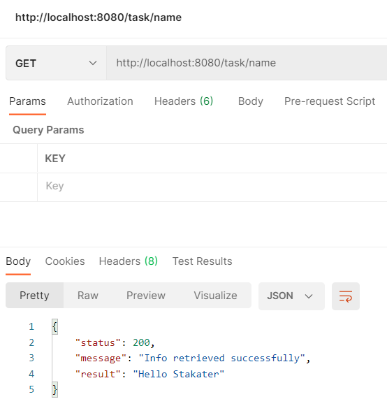

# Stakater Backend!

This project was created using Java11, SpringBoot along with Gradle, following the Spring MVC stack and getting the initial boilerplate from https://start.spring.io/ and got in the works using Intellij IDEA 2020.2.4. Several packages are used to create the following layers: repositories, services, domain and controllers. The services layer transforms entities into DTOs through ModelMapper and Lombok plugin came handy on Builder pattern implementation. The controllers layer is about RESTful services with just one GET endpoint to return the current **Name** which is an environment variable. This endpoint was configured with the annotation **@CrossOrigin** to accept requests from port 9000 which is the port used by the Frontend.

# Dockerfile

Everything related to the images and containers was created using Docker Desktop Version 3.3.3 (64133) on Windows. The following are the commands for building the image and run a container.
```
docker build --build-arg JAR_FILE=build/libs/task-0.0.1-SNAPSHOT.jar -t luisjavierjn/stakater-spring-boot:1.0 --no-cache .
docker run -p 8080:8080 -e NAME='Stakater' luisjavierjn/stakater-spring-boot:1.0
```
As you might notice the jar file is being copied inside the image and an environment variable NAME is sent to the container when it runs. The image was uploaded to the following repository:

https://hub.docker.com/repository/docker/luisjavierjn/stakater-spring-boot



# Kubernetes

The folder Kubernetes contains the yaml file auto-generated when a resource is created through the Kubernetes dashboard out of the image previously loaded in docker**hub**. Docker Desktop brings Kubernetes v1.19.7 as a single-node cluster, it is part of the options that can be enabled to start off along with Docker. The following commands enable the usage of the dashboard for the Kubernetes cluster coming from Docker Desktop, set an **Skip** button to the initial screen for fast entry and trigger the dashboard.
```
kubectl apply -f https://raw.githubusercontent.com/kubernetes/dashboard/v2.2.0/aio/deploy/recommended.yaml
kubectl patch deployment kubernetes-dashboard -n kubernetes-dashboard --type 'json' -p '[{"op": "add", "path": "/spec/template/spec/containers/0/args/-", "value": "--enable-skip-login"}]'
kubectl proxy
```
Then we search this URL in the browser:
```
http://localhost:8001/api/v1/namespaces/kubernetes-dashboard/services/https:kubernetes-dashboard:/proxy/
```